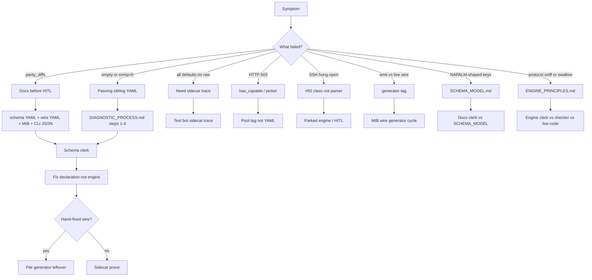
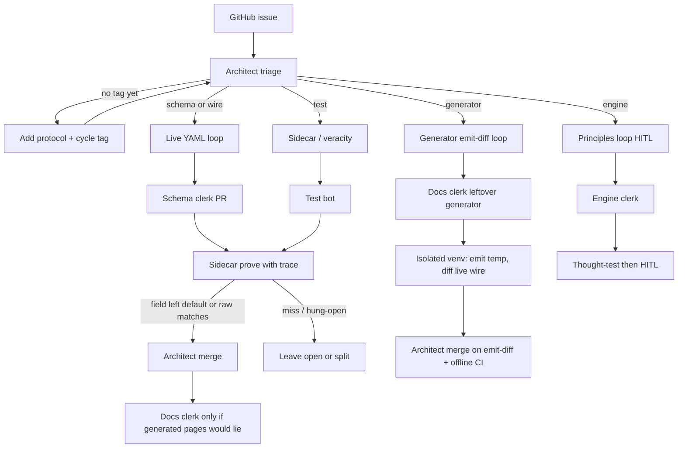

# Diagnostic Process — Fixing Failing Methods

> Follow this order strictly. Do NOT skip steps. Do NOT jump to engine code.

## The Ladder

### Step 1: Compare to a passing sibling

Find a method that passes using the same schema, engine path, or primitive. Diff the YAML declarations. Shape mismatch = contract bug, not engine bug. If radius passes and tacacs fails in the same schema, the answer is in the YAML difference.

### Step 2: Trace

`device.method_name(args, debug=True)` — see exactly what the pipeline produces at each step. What did intent resolution emit? What did the wire transform produce? What did the driver receive?

### Step 3: Validate off

`device.method_name(args, validate=False)` — if Gate 2 or 3 blocks, does it work without validation? If yes, the gate declaration is wrong, not the data.

### Step 4: Wire audit

Check against MIB source (`local/reference/MIBs/`) and MOPS schema (`local/reference/MOPS/mops_hios.xml`). Is `access:` right? Is `type:` right? Is `index_field:` present? Is `create_method:` correct? Is `index_type:` declared?

### Step 5: v1 reference

How did historical v1 (old napalm-hios monolith — a separate tree, not this repo) handle this table? Not to copy code, but to understand what encoding/sequence the device expects. v1's working code is empirical proof of what the wire needs. This product is this repo (`crude-engine`); do not assume a machine-local homelab path.

### Step 6: Fix the declaration, not the engine

Schema fix first. Wire fix second. Engine fix never — unless the primitive genuinely doesn't exist and affects multiple features.

If you fix a wire YAML manually, file a GitHub issue for the generator leftover (prove-then-file). Do not add a live `docs/TODO.md`.

### Step 7: Engine changes — last resort

Only after proving the gap affects multiple features and can't be declared away. Then design the primitive generically. Never add `if/else` for specific features.

## Fault detection

Map the symptom to a doc, then a clerk. Do not skip to engine code. Do not pick a 2-of-3 winner.

| Symptom | Read these first | Then |
|---------|------------------|------|
| Protocols disagree on a field | Schema YAML, wire YAML + SSH overlay, MIB OBJECT-TYPE, CLI JSON | Schema clerk. Raw from sidecar trace, not a person. |
| Empty table / snmp=0 | This doc step 1 sibling method, step 4 `index_field` / INDEX / AUGMENTS | Schema clerk. Not one engine bug. |
| Getter equals schema defaults only | Not a fail, not a live pass. Need a field leaving default **or** trace/raw | Test bot `trace:true`. All-defaults + no raw = you know nothing. |
| HTTP 503 | Picker: feature in `has_capable` AND `read` in `safe_for` | Pool / Test bot. Not a schema miss. |
| SSH timeout, `open_ms`/`call_ms` null | Hung-open, not parser. YAML budgets may not reach hardcoded timeout | Engine parked (#92 class). Not a YAML overlay. |
| Generator emit ≠ live wire | Leftover `batch_generate_MIB` vs `crude_engine/wire` | `generator` tag. Docs clerk leftover generator. Never write live wire. |
| Keys look NAPALM (`is_up`, `remote_*`) | `docs/SCHEMA_MODEL.md` Canonical Output Shape Rules + hitlist | Docs audit. Schema patches YAML. Shim keeps reshape. |
| `if protocol ==` / swallow / device heuristic | `docs/ENGINE_PRINCIPLES.md` + `scripts/check_principles.py` | Engine clerk. Checker is not assumed perfect. HITL before patch. |
| Gate 1/2/3 / commitFailed / unknown field | This doc Common Root Causes table | Schema / assemble. Engine last, and only as a generic primitive. |

## Tagged fix cycles

GitHub tags pick the loop. Architect triages and merges. Proof kicks upstairs. Never `--gate` from the VM.

| Tag | Start | Who | Proof kicked upstairs | End |
|-----|-------|-----|----------------------|-----|
| `schema` / `wire` | YAML vs MIB/CLI/live | Schema clerk | Sidecar YAML prove (`*.read` + trace; not all-defaults-without-raw) | Architect merge |
| `generator` | Leftover emit vs live `crude_engine/wire` | Docs clerk (`local/generator`) | Isolated emit-diff (never write live `crude_engine/wire`); keep-list shrunk | Architect merge, no sidecar |
| `engine` | Live code vs `ENGINE_PRINCIPLES.md` | Engine clerk | Principles vs checker; no patch until HITL | HITL |
| `test` | Catalog / sidecar / veracity | Test bot | Sidecar / veracity inspect dump or offline proof | Architect merge if a PR |
| `docs-generated` | Generated page would lie | Docs clerk | Generator PR, no hand-edit of pages | Architect merge |
| untagged | New issue | Architect | Labels + one confirm-only order | Loop starts |

`--gate` / PyPI stays human (Adam HITL). Not a VM tag loop.

## Where answers live

| Question | Doc / tree |
|----------|------------|
| Output shape | `docs/SCHEMA_MODEL.md` |
| YAML key → pipeline stage | `docs/SCHEMA_PRIMITIVES.md` |
| Must not live in Python | `docs/ENGINE_PRINCIPLES.md` |
| Method failing, ordered steps | this doc (ladder) |
| Wire binding / OID / overlay | `crude_engine/wire/` + `docs/WIRE_SPEC.md` |
| Device OBJECT-TYPE | `local/reference/MIBs/` |
| CLI spelling / range | `local/reference/CLI/cli_ref_hios_merged.json` |
| MOPS field names | `local/reference/MOPS/mops_hios.xml` |
| Release / `--gate` | `docs/ROADMAP.md`, `docs/RELEASE_GATE.md` — HITL |

## Future: vendor profile (not current)

A new vendor profile for crude-engine is MIB + documentation + generator (MIB-standard rules consistent across SNMP vendors; vendor leftovers as overlays) + sidecar prove on a pointed-at device. HITL shrinks to first device and `--gate`, not every field. That is the ceiling. It is not true today.

## Key Principles

- **The YAML declares what should happen.** The engine executes unambiguously.
- **The CRUDE matrix encodes and decodes.** Not the transports. Transports are stupid — they send what they're given.
- **Schemas group by user intent**, not MIB structure. Cross-MIB attrs in one schema is correct when they serve the same user intent. WebUI pages are a good reference for what belongs together.
- **Standard output pattern**: globals + indexed sub_table for any feature with scalar config + table rows.
- **Never sniff data** to decide processing. If the engine needs to branch, the schema is missing a declaration.

## Common Root Causes

| Symptom | Likely cause | Fix layer |
|---------|-------------|-----------|
| `commitFailed` on CREATE | Missing required fields in create `defaults:` | Schema |
| `commitFailed` on SET | Feature/port not enabled (prerequisite) | Test setup |
| `unknown field` in Gate 1 | `set_format` template fields not consumed, or method `fields:` missing | Schema / assemble |
| HTTP 400 on compound table | Missing `index_type` or `index_fields` on wire, or `defaults:` missing addr_type | Wire / Schema |
| Value not encoded (raw IP instead of hex) | Syntax not registered for driver — compound fields not in `attr_syntaxes` | Engine (syntax registration) |
| DELETE requires index | Compound index: `_resolve_compound_index` needs values in kwargs or defaults | Schema `defaults:` |
| Walk returns full table instead of scalar | Use `index_filter:` with `value_map:` for targeted cell read | Schema |
