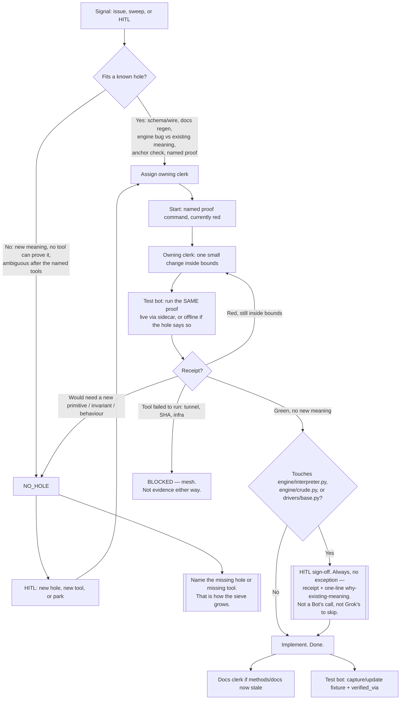

# Base flow — does this fit a hole?

Owned by no single clerk. Architect routes through this. Branch this chart
when a real object does not fit — then update the owning clerk's
`INSTRUCTIONS.md` to match. Do not invent holes speculatively.

