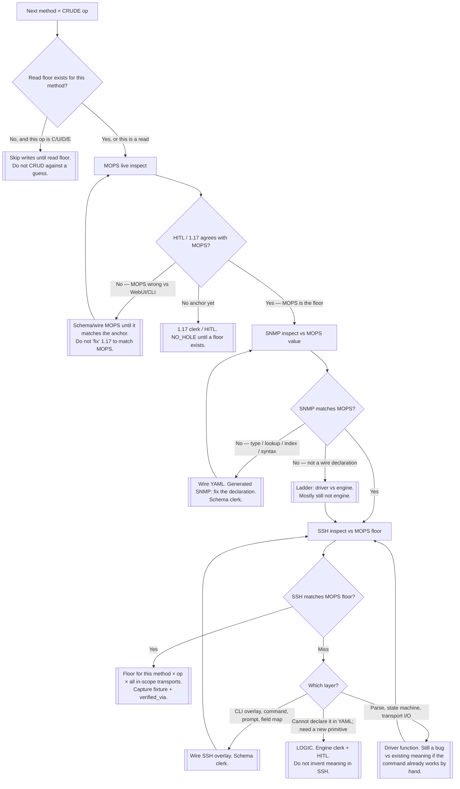

# Conform — known state → finished state

The smash loop once live devices are reachable. Nested, ordered, always against a
HITL-agreed value — never three protocols agreeing with each other.

```
for each method in schema:
  for each CRUDE op the method declares (read first; C/U/D/E only after read floor):
    1. MOPS  — HITL baseline (WebUI / 1.17). This is the floor.
    2. SNMP  — conform to that MOPS value (generated wire: type, lookup, index).
    3. SSH   — same floor. Classify miss: wire | driver | engine/primitive.
```

Two known goods after step 1: the MOPS receipt **and** 1.17/WebUI. SNMP and
SSH steer toward those, not toward each other.


