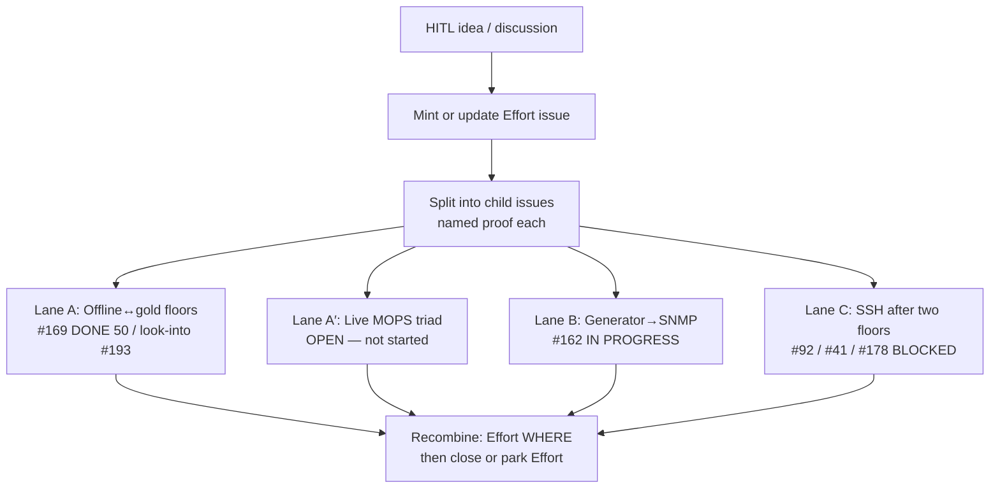

# Effort board — tangible goals (bubbles)

Owned by Architect. Chart first: when HITL names a multi-session goal, it
becomes an Effort issue; children split off; the Effort stays open until
pieces resolve or HITL parks it. This mermaid is the glance; GitHub Issues
are the objects clerks bounce inside.

Update when a bubble splits, greens, or blocks. Do not leave the board only
in chat.

Rules:

- Chat is signal, not storage.
- Local Architect MD is cache.
- User-owned Projects V2 is not writable via fine-grained PAT — do not depend on it.
- Six clerks only; Architect holds the board and assigns hops.
