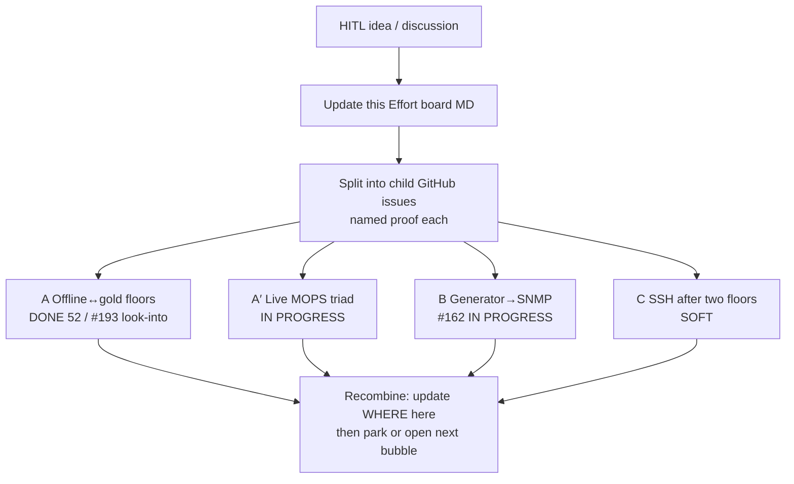

# Effort board — tangible goals (bubbles)

Owned by Architect. Lives **in this repo** under `local/agents/` so HITL can
open it on GitHub anytime. Chart first: when HITL names a multi-session goal,
update this board before (or as) clerks spin. Children are GitHub issues.
Chat is signal, not storage.

## What an Effort is

1. **Goal** — multi-session, broadly named (not a single PR).
2. **Finished looks like** — concrete enough to say yes/no without re-arguing.
3. **Poke loop** — Architect/clerks keep opening small issues, PRs, and named
   proofs until finished-looks-like is true (or HITL parks it). Middle may be
   wrong; start and end stay fixed.

Chat names the Effort once. The board + child issues *are* the Effort after that.

## Live bubbles (update in PRs — not only in chat)

| Bubble | Status | Children |
| --- | --- | --- |
| **A** Offline↔gold floor growth | **DONE** floors=**52** | #169 trail; unfloorables → #193 (poe status-null + route_to); merge #257 `3ca9974` (#258 closed duplicate) |
| **A′** Live MOPS triad (gold / Offline / live) | **IN PROGRESS** | #229 — floored MOPS receipts done (49/49 class); look-intos as filed |
| **B** Generator → SNMP vs MOPS known-good | **IN PROGRESS** | #162 teach progressed; live 36/43; Schema #233–#235 **closed**; #231→#12 parked; TC-BITS in #205 parked — see `hitl-engine-park.md` |
| **C** SSH after two good floors | **SOFT** | Timeout detection done (#179–#225); **#92 stays closed**. Parse/parity leftovers: #226 #227 #228 #217 #178 #62 + older fold-ins #44 #46 #54 #55. Prefer A′/B over stalling. |

## Rules

- Every open issue hangs on this board, companion #195, or `hitl-engine-park.md` — fold orphans in; do not leave silent backlog.
- Companion issue [#195](https://github.com/AdamRickards/crude-engine/issues/195) mirrors this table — update **both** in one hop when bubbles change.
- HITL/Engine park lives in `hitl-engine-park.md` (not duplicated as a fifth bubble).
- Tangibility: if it is not on GitHub in this folder (or a child issue), it is not the Effort.
- Architect updates this file when a bubble splits, greens, or blocks.
- Six clerks only; Architect holds the board and assigns hops.
- No lab identity on GitHub.

## Tracked outside floors Effort (fold-in 2026-09-14)

Every open issue must hang on this board or `hitl-engine-park.md`. These were open but unnamed; reprocessed under current mechanics (no seventh clerk; soft hops vs Engine/HITL park).

| Bucket | Status | Children |
| --- | --- | --- |
| **R** Release / RC | **PARKED** — needs HITL `--gate` | #14 setter/CRUD matrix (260 jobs). Not a floors poke; Architect does not close release without hand-back. |
| **L** Lab / fixture capture | **PARKED** — HITL | #110 multi-device leftover fixture trees (office L3 vs other profiles). No lab identity on GitHub. |
| **F** Feature gap (webUI tab) | **BACKLOG** | #129 Traffic Management Egress / shaping-rate getter — Schema/wire when HITL prioritises; not A′/B blocker. |
| **T** Tooling | **SOFT** | #156 honour `debug=foreign` / `trace=engine` (post #155). Docs/Engine soft when free; not floors-critical. |

Engine cycle-0 that need primitives or checker work live on **`hitl-engine-park.md`**: #30 SNMPHIOS.close tax; #115 `to_bool` false-vocab; #116 `sort:natural` port heuristic — plus existing #12/#68/#106 rows.

## Finished looks like (this board)

| Bubble | Finished looks like |
| --- | --- |
| **A** | Offline↔gold floor growth done for floorable methods; unfloorables filed — **met** (52 floors, #193) |
| **A′** | MOPS + Offline proved against Gold, Config/XML Offline, and Live (named sweeps; look-into list exists) |
| **B** | Generator emit≈live for teachable residuals; SNMP meets MOPS known-good floor on named proves |
| **C** | SSH leftovers worked only after A′+B floors hold; timeout *detection* done (#179–#225); #92 stays closed; parse/parity soft backlog includes older fold-ins |
