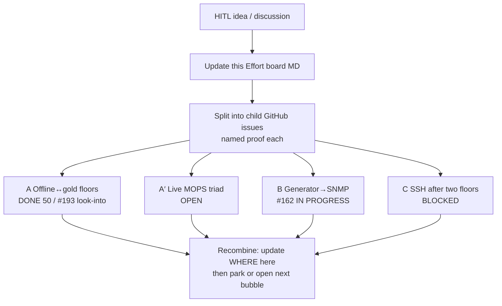

# Effort board — tangible goals (bubbles)

Owned by Architect. Lives **in this repo** under `local/agents/` so HITL can
open it on GitHub anytime. Chart first: when HITL names a multi-session goal,
update this board before (or as) clerks spin. Children are GitHub issues.
Chat is signal, not storage.

## What an Effort is

1. **Goal** — multi-session, broadly named (not a single PR).
2. **Finished looks like** — concrete enough to say yes/no without re-arguing.
3. **Poke loop** — Architect/clerks keep opening small issues, PRs, and named
   proofs until finished-looks-like is true (or HITL parks it). Middle may be
   wrong; start and end stay fixed.

Chat names the Effort once. The board + child issues *are* the Effort after that.

## Live bubbles (update in PRs — not only in chat)

| Bubble | Status | Children |
| --- | --- | --- |
| **A** Offline↔gold floor growth | **DONE** floors=50 | #169 closeout; unfloorables → #193 |
| **A′** Live MOPS triad (gold / config Offline / live) | **OPEN** | not started |
| **B** Generator → SNMP vs MOPS known-good | **IN PROGRESS** | #162: RouterID+AreaID+VlanId taught (#197/#199/#201); next **LacpKey**; 1 VlanId wire-leftover |
| **C** SSH after two good floors | **BLOCKED** | #92 budgets; #41 banner live; #178 get_aca SSH |

## Rules

- Tangibility: if it is not on GitHub in this folder (or a child issue), it is not the Effort.
- Architect updates this file when a bubble splits, greens, or blocks.
- Six clerks only; Architect holds the board and assigns hops.
- No lab identity on GitHub.

## Finished looks like (this board)

| Bubble | Finished looks like |
| --- | --- |
| **A** | Offline↔gold floor growth done for floorable methods; unfloorables filed — **met** (50 floors, #193) |
| **A′** | MOPS + Offline proved against Gold, Config/XML Offline, and Live (named sweeps; look-into list exists) |
| **B** | Generator emit≈live for teachable residuals; SNMP meets MOPS known-good floor on named proves |
| **C** | SSH leftovers worked only after A′+B floors hold; #92 budget/attribution floor honest |
