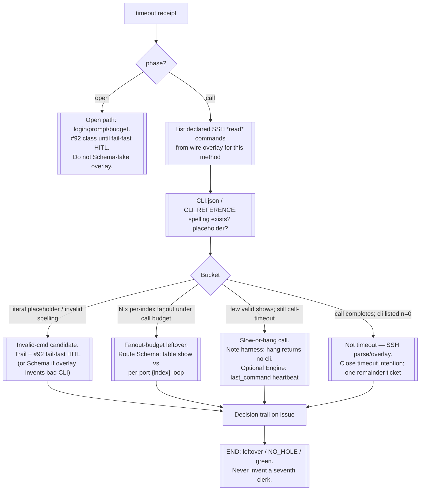

# Inspect timeout resolution (open vs call)

After `#179`, inspect timeouts carry `phase=open` or `phase=call`.
Attribution is the **finder**. Resolution is a **Test-bot poke loop**
(classify + route — never author a fix). Living law:
[`../test-bot/flow.md`](../test-bot/flow.md) § Call-timeout resolution.

## Why CLI.json before another live poke

On `phase=call` **timeout**, the worker thread never returns — so
`trace:true` often has **no** `cli` / `last_cli` in the receipt (hang
never hits `_collect_cli`). Declared commands from
`crude_engine/wire/ssh/*.yaml` + `local/reference/CLI/cli_ref_hios_merged.json`
are the first honest poke. Live re-inspect still proves budgets/phase;
it does not by itself name the stuck `show`.

## Buckets (glance lines for the issue)

| Bucket | Meaning | Route |
| --- | --- | --- |
| open-budget | `phase=open` under current `inspect.yaml` | #92 / budget; not overlay |
| call-budget-fanout | Many `{index}` / per-row reads vs call budget | Schema (collapse to table `show`) |
| call-invalid-cmd | CLI not in CLI.json, or literal `{index}` in transcript when call completes | #92 fail-fast HITL and/or Schema |
| call-unknown-hang | Few valid shows; still `phase=call` timeout; no cli | Trail; Engine `NO_HOLE` if need last_command heartbeat |
| timeout-cleared-parse | `status=ok` but n=0 / wrong shape | SSH remainder ticket; not #92 |

