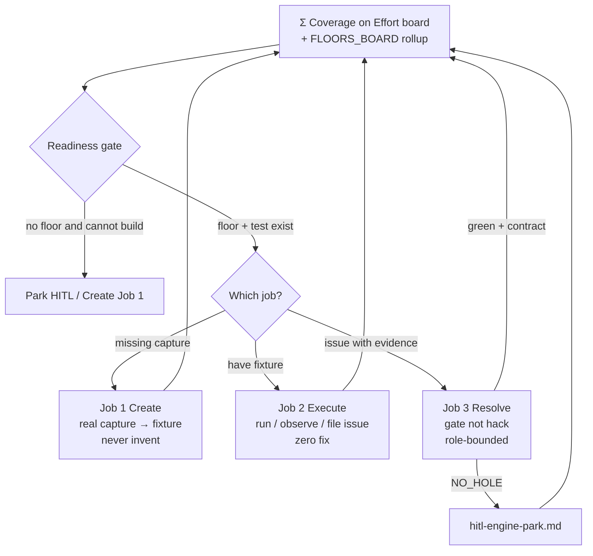

# Resolution loop — Create → Execute → Resolve

Chart for the end-game Effort (**Σ Coverage** on `effort-board.md`).
HITL source (raw, not law): `../architect/resolution-methodology.md` (#287).
Distilled 2026-09-21.

## End state (countable)

```
coverage = (method × protocol pairs proven against a floor)
         / (method × protocol pairs possible once a floor exists)

exceptions = { HITL-approved gaps }, each with clerk + evidence + reason

done when: coverage → 100% of *possible*, and everything short of that is
           in-flight or an explicit exception — never a silent gap
```

Living glance / rollup: [`docs/FLOORS_BOARD.md`](../../../docs/FLOORS_BOARD.md)
(`scripts/generate_floors_board.py` — never hand-edit).

Possible ≈ rows with `floor_source=gold` × `{offline,mops,snmp,ssh}`.
Proven = those cells with value `pass`.

## Infinite poke (same loop forever)



Middle may be wrong; ends stay fixed. A′/B/C lanes are *how* we thicken
floors and meets-floor cells — they feed Σ, they are not a second Destination.

## Readiness gate (before any Resolve attempt)

For the method × protocol pair:

1. **Floor** — known-good reference (device-proved gold / Offline / live)?
2. **Test** — something checks current output against that floor?
3. **Reference** — if 1 or 2 missing, can MIB/schema/sibling protocol build them?
4. **Device** — live ground truth reachable if needed (Tier rules below)?
5. **Comparative floor** — another already-passing protocol to triangulate?

**Rule:** if 1 and 2 both fail and 3 cannot build them → stop, park HITL.
No floor, no agentic Resolve.

## Three jobs (do not conflate)

| Job | Success looks like | Not success |
| --- | --- | --- |
| **1 Create** | Fixture is a real authoritative capture | Code passes the new test |
| **2 Execute** | Ran tests; filed disagreements with evidence | Fixed anything |
| **3 Resolve** | Test-green **and** contract-respecting (YAML declares; no engine hack) | Test-green by any means |

Construction order for Create: live device → capture → *then* fixture.
Never invent values so code and fixture agree.

## Create authorization (pilot finding)

| Tier | Artifact | Path | Who |
| --- | --- | --- | --- |
| **1** | `tap1`+`tap3` → `test_engine` | Direct `tests/capture.py` (not sidecar — tap1 raw withheld for MOPS/SNMP by design) | Rare, careful Create |
| **2** | `tap3`+`tap4` → `test_napalm` | Sidecar `/v1/run`; label fixtures by sidecar `label`, never IP | Any clerk |

SSH tap1-via-`trace:true` reshape to capture shape = still open (see HITL source).

`tests/fixtures/offline_gold/gold_floors.json` is **sanitized** — off-limits as a Create fixture source. Provenance/`floor_source=gold` already guards the glance.

## Resolve discipline

- Prefer existing schema/wire tools (Architect check 3).
- SSH: 1.17 + CLI.json guess ladder (check 9).
- Batch-scan park piles before resolving one item (#92 / #162 pattern).
- Engine invent / new primitive → park, soft hops keep moving (check 8).

## Visualization

Docs renders only — `FLOORS_BOARD` / future Pages grid from
`floors_provenance.json` + catalogue. Never hand-edit status into a view.
