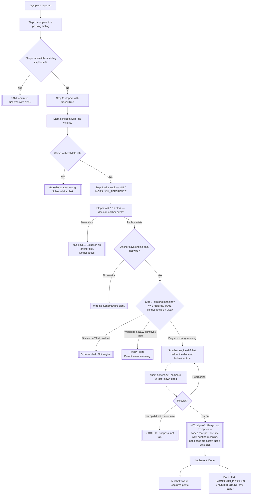

# Engine clerk — decision flow

Same ladder as `docs/DIAGNOSTIC_PROCESS.md`, as a tree. Most symptoms exit
before step 7. Branch this chart when a real object does not fit.

Pipeline trace is `trace=True`, not `debug=True`.

