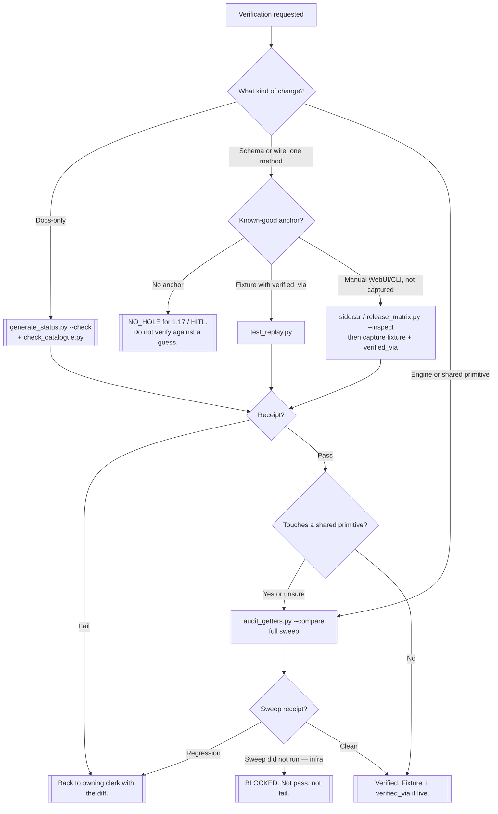

# Test bot — which proof lane

Branch this chart when a real object does not fit. Do not invent lanes.

```mermaid
flowchart TD
    Start[Verification requested] --> Q1{What kind of change?}
    Q1 -->|Docs-only| Skip[["generate_status.py --check\n+ check_catalogue.py"]]
    Q1 -->|Schema or wire, one method| Q2{Known-good anchor?}
    Q1 -->|Engine or shared primitive| Full["audit_getters.py --compare\nfull sweep"]
    Q2 -->|No anchor| Anchor[["NO_HOLE for 1.17 / HITL.\nDo not verify against a guess."]]
    Q2 -->|Fixture with verified_via| Replay["test_replay.py"]
    Q2 -->|Manual WebUI/CLI, not captured| Inspect["sidecar / release_matrix.py --inspect\nthen capture fixture + verified_via"]
    Replay --> Q3{Receipt?}
    Inspect --> Q3
    Skip --> Q3
    Q3 -->|Fail| Back[["Back to owning clerk with the diff."]]
    Q3 -->|Pass| Q4{Touches a shared primitive?}
    Q4 -->|Yes or unsure| Full
    Q4 -->|No| Done[["Verified. Fixture + verified_via if live."]]
    Full --> Q5{Sweep receipt?}
    Q5 -->|Regression| Back
    Q5 -->|Sweep did not run — infra| Infra[["BLOCKED. Not pass, not fail."]]
    Q5 -->|Clean| Done
```
