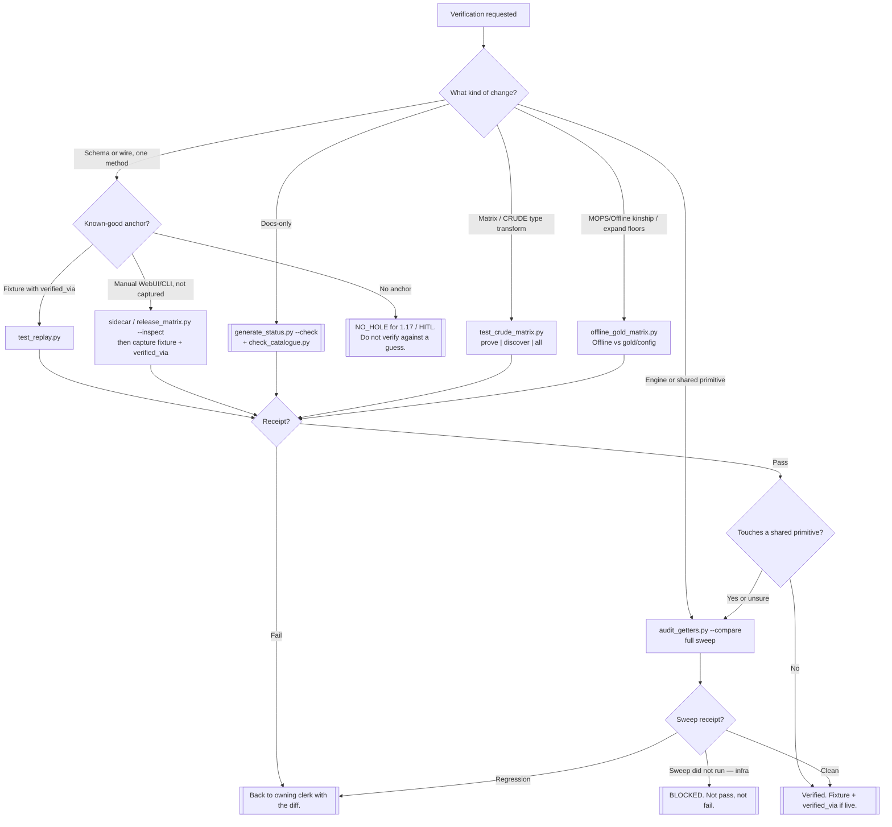

# Test bot — which proof lane

Branch this chart when a real object does not fit. Do not invent lanes.

## Offline vs gold (standing)

Run `PYTHONPATH=. python3 tests/offline_gold_matrix.py` after MOPS/Offline
client or FeatureEngine gather changes, when expanding sanitized floors, or
before treating Offline as kinship-proof for live MOPS. Optional
`--config` / `--gold` may point at a **local bag** NVM XML + floors for a
wider prove — never commit device identity; committed floors stay sanitized
under `tests/fixtures/offline_gold/`. Receipt: match / mismatch /
`config_absent` counts (`config_absent`∩gold = followup, not fail). Exit ≠ 0
only on real `mismatch`.

