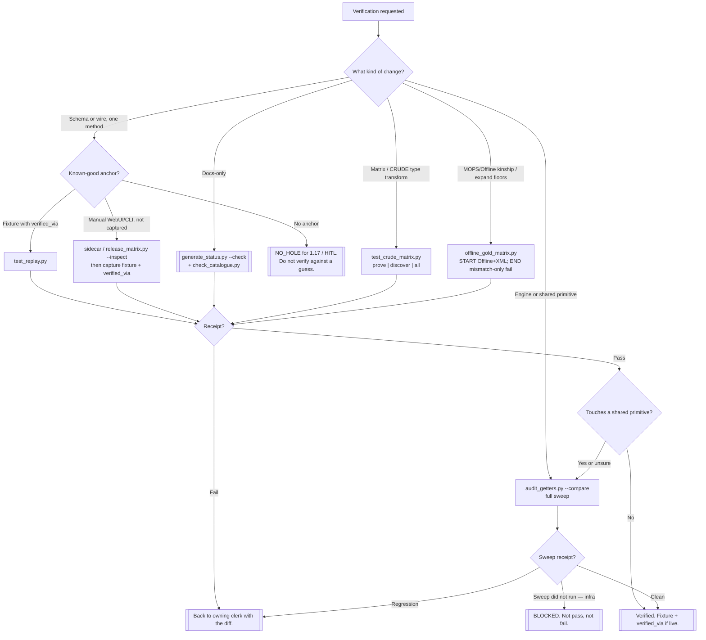

# Test bot — which proof lane

Branch this chart when a real object does not fit. Do not invent lanes.

## Offline vs gold (standing)

**Goal:** prove Offline (saved config / OfflineHIOS). Offline shares the MOPS
driver path, so a green prove is also kinship that MOPS gather shape works
against that config. Gold is not a second offline loader — it is the
**floor** (what should come back) and the mismatch catcher. Config prove
first, gold floor second; live sidecar is not required for this lane.

- **START:** schema method + Offline transport + saved mibconf XML
  (config = configured state = Offline’s literal intention). Named proof:
  `PYTHONPATH=. python3 tests/offline_gold_matrix.py` (optional bag
  `--config` / `--gold`; never commit identity — sanitized floors stay under
  `tests/fixtures/offline_gold/`).
- **WHERE WE ARE:** method coverage vs floors (committed sanitized vs
  bag-local), last proof counts, open `config_absent` followups. Expand
  floors method-by-method after the lane is named.
- **END:** receipt with classifications — real fail only on `mismatch`;
  `config_absent`∩gold = followup (oper/live not in NVM), not fail. Exit ≠ 0
  only on `mismatch`.

When: after MOPS/Offline client or FeatureEngine gather changes; when
expanding sanitized floors; before treating Offline as kinship-proof for
live MOPS.

